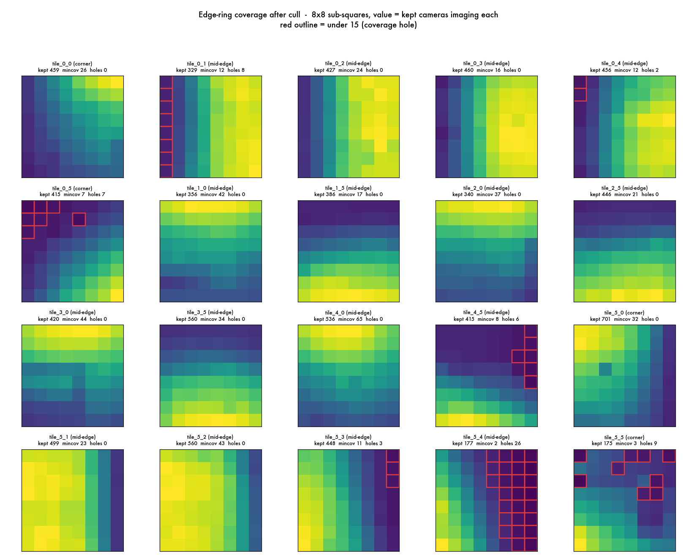
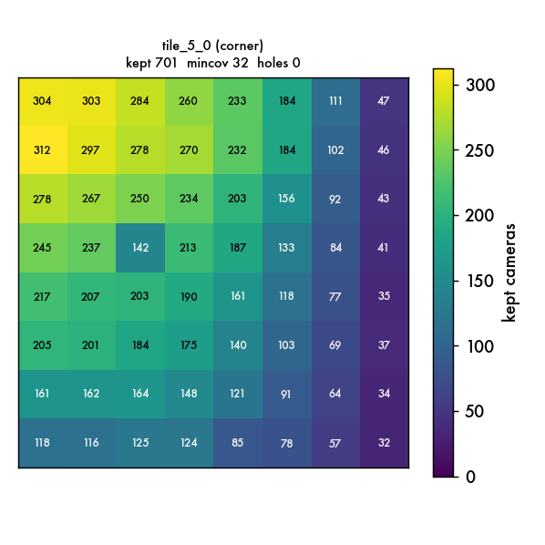
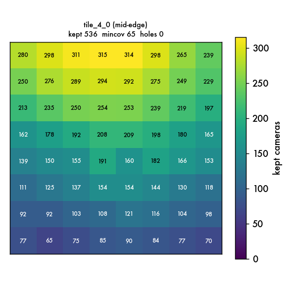
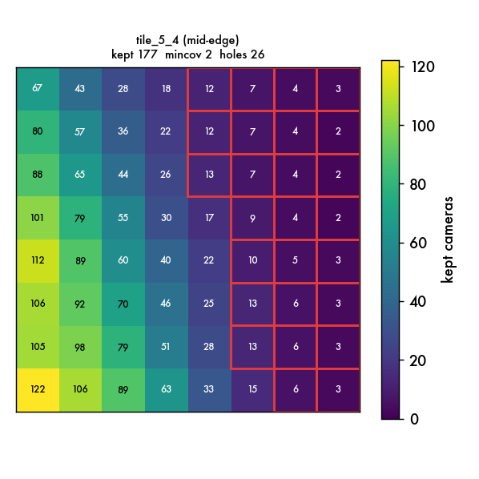
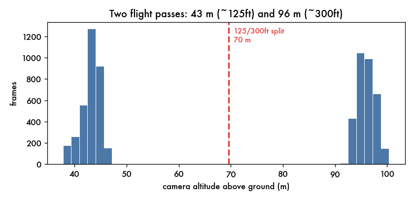

# Edge-ring frame-cull evidence  -  Oakland Cemetery 6x6 (26-002)

_Generated 2026-07-21 04:57:33. This is a **proposal**: no images.txt has been changed. The cull applies only after Joel approves._

## The problem, in one line

The 20 outer cells of the 6x6 partition each carry far more cameras than the 16 interior cells (which sit at a healthy **318-652** cameras). The high 300ft obliques see the whole cemetery, so the outer cells inherited **1,499-6,588** cameras each - the four corners caught all 6588 frames. Training those at native 8192 is impractical. This plan keeps, per outer cell, only the cameras that actually resolve *that cell's* ground well, bringing each into the interior's healthy range.

## The ranking rule (plain language)

Each camera is scored for how usefully it resolves a given cell, as a product of three factors:

1. **Ground sampling (proximity)** - the closer a camera is to the cell, the finer the detail it records. Since every frame shares the same lens, resolution on the ground is set by slant distance, so this is the dominant factor. A low 125ft frame over the cell beats a 300ft oblique shot from across the site. `gsd = 40 / (40 + distance_m)`.

2. **Does it actually look at the cell (overlap)** - the cell's ground is sampled on an 8x8 grid; the factor is the fraction of that grid the camera frames, but it **saturates at a quarter**. A frame must point at the cell, yet 'sees the whole cell in one shot' is a far-camera trait we deliberately do not reward - otherwise we would keep exactly the distant obliques we are trying to shed. A near 125ft frame covers only ~a quarter of a cell, so this saturation is what lets the near frames win.

3. **Straight-down vs oblique (nadir)** - nadir frames give the cleanest ground sampling, so they get a mild bonus (factor `0.60 + 0.40*nadir`, nadir=straight down). Obliques are only discounted, not excluded, because a cemetery's monuments and facades need some oblique looks.

A camera that images none of the cell scores zero and is dropped automatically. Terrain height is handled per-cell (Oakland's ground rises ~16 m from the low ground to the far corners), so coverage is measured against each cell's real surface, not a flat plane.

**Why these weights:** proximity is the one thing you cannot recover later - you either captured the detail or you did not - so it drives the score continuously; overlap is a gate, not a prize; nadir is a light thumb on the scale. The three were tuned so the reproduction test below matches the known-good interior assignments.

## Calibration against known-good (interior cells)

To trust the metric, it is run on interior cells - whose camera sets the partition already chose and which trained fine - and asked to reproduce those sets. Scoring **all 6588** frames for each interior cell and taking the top-N by the rule:

- **tile_2_2** (n=382, terrain y=-11.2): recall 68% @N, 74% @1.5N, 85% @2N; **AUC 0.894**
- **tile_1_1** (n=350, terrain y=-12.1): recall 64% @N, 71% @1.5N, 85% @2N; **AUC 0.895**
- **tile_4_3** (n=652, terrain y=-0.4): recall 64% @N, 80% @1.5N, 80% @2N; **AUC 0.836**

The **AUC ~0.84-0.89** is the headline: a camera the partition assigned outscores one it did not roughly **87% of the time**, so the rule and the known-good process agree on which cameras belong. Exact-N recall sits near 65% and climbs to ~83% by 2N - the gap is boundary churn plus nearby frames from adjacent cells that legitimately see the interior cell too. The rule reproduces the good set's core and refines its margins toward closer, more nadir frames.

## Per-cell result

`before` = cameras the partition assigned; `eligible` = of those, how many actually image the cell; `keptN` = kept after the cull; `min_cov` = fewest kept cameras over any of the 64 sub-squares (want >=15); `holes` = sub-squares under that.

| tile | role | before | eligible | keptN | %125ft | ground_y | min_cov | holes | cutoff |
|---|---|---|---|---|---|---|---|---|---|
| tile_0_0 | corner | 6588 | 459 | 459 | 17 | -8.8 | 26 | 0 | 0.0059 |
| tile_0_1 | mid-edge | 1707 | 329 | 329 | 47 | -11.9 | 12 | 8 | 0.0100 |
| tile_0_2 | mid-edge | 2035 | 427 | 427 | 38 | -10.7 | 24 | 0 | 0.0157 |
| tile_0_3 | mid-edge | 2068 | 460 | 460 | 37 | -8.8 | 16 | 0 | 0.0122 |
| tile_0_4 | mid-edge | 1906 | 456 | 456 | 41 | -9.0 | 12 | 2 | 0.0156 |
| tile_0_5 | corner | 6588 | 415 | 415 | 31 | -6.7 | 7 | 7 | 0.0060 |
| tile_1_0 | mid-edge | 1533 | 356 | 356 | 21 | -9.9 | 42 | 0 | 0.0105 |
| tile_1_5 | mid-edge | 1533 | 386 | 386 | 42 | -7.4 | 17 | 0 | 0.0112 |
| tile_2_0 | mid-edge | 1499 | 340 | 340 | 21 | -8.7 | 37 | 0 | 0.0112 |
| tile_2_5 | mid-edge | 1499 | 446 | 446 | 39 | -8.5 | 21 | 0 | 0.0117 |
| tile_3_0 | mid-edge | 1864 | 420 | 420 | 25 | -4.7 | 44 | 0 | 0.0058 |
| tile_3_5 | mid-edge | 1864 | 582 | 560 | 43 | -5.2 | 34 | 0 | 0.0273 |
| tile_4_0 | mid-edge | 1959 | 536 | 536 | 22 | -3.3 | 65 | 0 | 0.0058 |
| tile_4_5 | mid-edge | 1959 | 415 | 415 | 35 | 0.7 | 8 | 6 | 0.0107 |
| tile_5_0 | corner | 6588 | 701 | 701 | 20 | 0.2 | 32 | 0 | 0.0059 |
| tile_5_1 | mid-edge | 1707 | 499 | 499 | 39 | -0.5 | 23 | 0 | 0.0195 |
| tile_5_2 | mid-edge | 2035 | 576 | 560 | 38 | 1.4 | 43 | 0 | 0.0452 |
| tile_5_3 | mid-edge | 2068 | 448 | 448 | 34 | 5.8 | 11 | 3 | 0.0144 |
| tile_5_4 | mid-edge | 1906 | 177 | 177 | 30 | 5.8 | 2 | 26 | 0.0142 |
| tile_5_5 | corner | 6588 | 175 | 175 | 1 | 4.4 | 3 | 9 | 0.0061 |

Across the 20 outer cells the cull drops the training load from **55,494** camera-slots to **8,565** (each cell now lands in the interior's healthy band), while every well-surveyed cell keeps full coverage.

## Coverage - at a glance

Each panel is one outer cell's ground on an 8x8 grid; the number is how many kept cameras image that patch; a red outline marks a coverage hole (under 15).

**A healthy corner - tile_5_0**

**A healthy mid-edge - tile_4_0**

**The weakest cell - tile_5_4**

## Altitude classes

The survey is two clean passes - the low '125ft' pass (measured ~43 m above ground here) and the high '300ft' pass (~96 m). The `%125ft` column above is each kept set's share from the low pass; that is the detail-bearing tier, so a higher share is better.

## Coverage holes: where they are, and how much they matter

The cull already keeps **every** camera that images each cell (nothing more can be added), so any remaining hole is a gap in the original survey, not a fault of the rule. There are two kinds, and only one is a real concern.

### The one genuinely hard region: the far high-ground corner (tile_5_4 + tile_5_5)

- **tile_5_4** (mid-edge): only **177** cameras image it at all (30% from the low 125ft pass), and 26 of 64 sub-squares fall under 15, some as low as 2. The gaps hug the cell's outer site-boundary edge (see the overview panel; tile_5_4 is also broken out in detail below), where the low pass simply did not reach.

- **tile_5_5** (corner): only **175** cameras image it at all (1% from the low 125ft pass), and 9 of 64 sub-squares fall under 15, some as low as 3. The gaps hug the cell's outer site-boundary edge (see the overview panel), where the low pass simply did not reach.

These are the two adjacent cells at the site's far, higher-elevation corner, where the 125ft detail pass thinned to almost nothing (1-30% of their frames). Nothing in the metric can fix a hole the survey never filled. **Recommendation:** merge tile_5_4 and tile_5_5 into a single far-corner tile - that pools ~350 cameras and both cells' geometry into one - and accept that this corner will render a step softer than the interior. If you would rather keep the grid uniform, train them as-is; they will simply be the softest two tiles in the set.

### The rest are cosmetic (all cameras kept)

**tile_0_1** (8 patches at 12-14 views), **tile_0_4** (2 patches at 12-14 views), **tile_0_5** (7 patches at 7-14 views), **tile_4_5** (6 patches at 8-14 views), **tile_5_3** (3 patches at 11-14 views) each flag a handful of edge sub-squares just under the 15 line - but those patches still hold **7-14 overlapping views**, which is ample for a Gaussian splat (it needs only a few). They sit on the outermost boundary strip of the site and every available camera is already retained, so there is nothing to fix. Treat these as green.

## What this does not touch

- The 16 interior cells (already healthy) are unchanged.

- No `images.txt` is rewritten. The kept-camera lists live in `C:\LidargraphCapture\status\edge_cull_plan.json`, ready to apply on approval.
